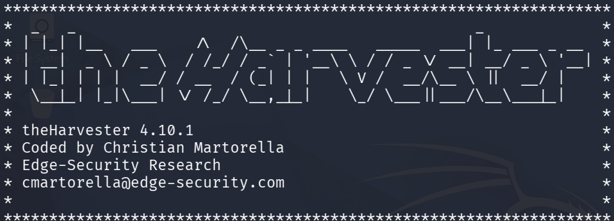
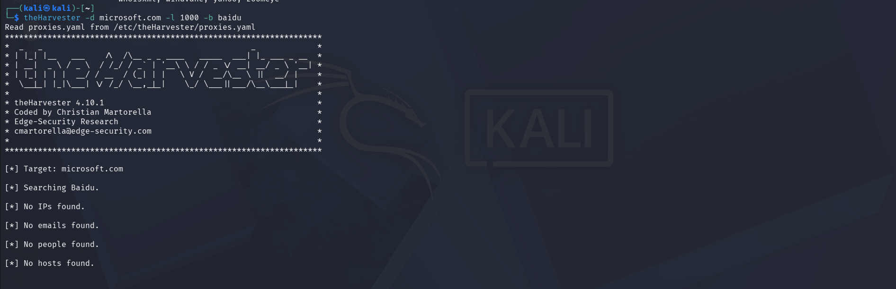

# 🔎 Footprinting & Reconnaissance with theHarvester

## 📌 Lab Overview

As part of my **Cybersecurity & Ethical Hacking internship with Networkwalks**, I performed a **Footprinting and Reconnaissance** exercise using **theHarvester 4.10.1** on Kali Linux.

The exercise focused on **Open-Source Intelligence (OSINT)** and passive reconnaissance to understand how publicly available information can reveal aspects of an organization's digital footprint.

**Target:** `microsoft.com`

> ⚠️ **Note:** This documentation focuses on reconnaissance methodology and learning outcomes. No exploitation, authentication testing, or vulnerability verification was performed.

---

## 🎯 Objective

The objectives of this exercise were to:

* Perform passive reconnaissance using theHarvester.
* Identify publicly discoverable hosts and subdomains.
* Identify associated IP addresses.
* Identify autonomous system numbers (ASNs).
* Identify publicly available email addresses.
* Identify URLs returned by reconnaissance sources.
* Understand the security relevance of publicly exposed information.
* Understand the limitations of automated OSINT tools.

---

## 🛠️ Tool Used

| Tool         | Version | Platform   | Purpose                        |
| ------------ | ------- | ---------- | ------------------------------ |
| theHarvester | 4.10.1  | Kali Linux | OSINT & passive reconnaissance |

---

## 💻 Commands Used

### 1. Baidu Search

```bash
theHarvester -d microsoft.com -l 1000 -b baidu
```

**Command breakdown:**

* `-d microsoft.com` → specifies the target domain.
* `-l 1000` → sets the result limit to 1,000.
* `-b baidu` → uses Baidu as the information source.

### 2. Multi-Source Search

```bash
theHarvester -d microsoft.com -l 50 -b all
```

**Command breakdown:**

* `-d microsoft.com` → specifies the target domain.
* `-l 50` → sets the result limit to 50.
* `-b all` → attempts to use all available supported sources.

---

## 🔍 Reconnaissance Results

The supplied theHarvester output reported the following:

| Finding            | Result |
| ------------------ | -----: |
| Hosts              |  9,978 |
| IP Addresses       |    148 |
| Autonomous Systems |     10 |
| Email Addresses    |      5 |
| URLs of Interest   |      5 |
| LinkedIn Users     |      0 |

### Important observation

The reported **9,978 hosts should not be interpreted as 9,978 unique servers**.

The output contained hostname entries, mappings, wildcard records and repeated representations. Proper normalization would be required before treating the results as a unique asset inventory.

---

## 🌐 Information Sources

The multi-source scan attempted reconnaissance through several sources, including:

* Baidu
* Certspotter
* DuckDuckGo
* crt.sh
* HackerTarget
* Common Crawl
* AlienVault OTX
* RapidDNS
* URLScan
* GitLab
* Wayback Archive

Several integrations were affected by missing or invalid API credentials, including sources such as Shodan, Censys, VirusTotal, GitHub, SecurityTrails, FOFA and LeakIX.

---

## 📊 Key Observations

### 1. Host & Subdomain Discovery

TheHarvester returned a large number of hostnames associated with the target.

The naming patterns included references to:

* Production environments
* Development environments
* Testing environments
* Administrative services
* Application interfaces
* Internal infrastructure naming

This demonstrates how publicly discoverable DNS and indexed information can provide insight into an organization's digital footprint.

### 2. IP Address Discovery

The scan reported both IPv4 and IPv6 addresses.

These results provide candidate information about infrastructure associated with the target.

However, the exercise did not independently verify whether each address was active, publicly accessible, or directly controlled by the target.

### 3. Email Discovery

Five publicly discoverable email addresses were identified.

Publicly available email addresses may potentially be useful in phishing or social-engineering scenarios.

However, discovering an email address does **not** establish that an account is compromised or vulnerable.

### 4. ASN Discovery

Ten ASNs were identified.

Multiple ASNs can indicate that an organization's externally visible infrastructure is associated with different network environments.

ASN discovery alone does not establish direct ownership of every identified network.

### 5. URL Discovery

Five URLs of interest were reported.

The results included publicly accessible web and authentication-related resources.

The presence of authentication-related parameters does not, by itself, demonstrate an authentication vulnerability.

---

## 🛡️ Security Perspective

From an attacker's point of view, publicly available information can assist in building an understanding of an organization's external attack surface.

From a defensive perspective, organizations should consider:

* Reviewing unnecessary publicly visible infrastructure information.
* Monitoring exposed DNS records.
* Properly isolating development and testing environments.
* Protecting administrative interfaces.
* Monitoring publicly exposed organizational information.
* Understanding third-party infrastructure relationships.

These are **potential security considerations**, not confirmed vulnerabilities.

---

## ⚠️ Limitations

The exercise had several limitations:

* Some OSINT sources required API credentials that were unavailable or invalid.
* Some services returned errors or incomplete results.
* Discovered hosts and IP addresses were not independently verified.
* No vulnerability scanning was performed.
* No exploitation was performed.
* No authentication testing was performed.
* The exact scan date could not be established from the supplied output.
* Host results require normalization before being treated as a unique asset inventory.

Therefore, the results represent a **preliminary reconnaissance dataset rather than a complete security assessment**.

---

## 📸 Evidence

The following evidence was captured during the exercise:




1. theHarvester command execution.
2. Baidu reconnaissance output.
3. Multi-source reconnaissance output.
4. Summary of discovered information.
5. Relevant reconnaissance findings.

**Sensitive or unnecessary infrastructure details should be blurred/redacted before public publication.**

---

## 💡 Lessons Learned

This exercise provided practical experience with:

* Open-Source Intelligence (OSINT)
* Passive reconnaissance
* Domain footprinting
* Host and subdomain discovery
* IP enumeration
* ASN discovery
* Email enumeration
* URL discovery
* Reconnaissance data interpretation
* Limitations of automated reconnaissance tools

### Key takeaway

> **Reconnaissance information is not the same as a confirmed vulnerability.**

A hostname, IP address, email address, or URL discovered through OSINT requires further authorized validation before any security weakness can be established.

---

## 📌 Conclusion

The exercise demonstrated how **theHarvester 4.10.1** can collect publicly available information from multiple OSINT sources.

Using the commands:

```bash
theHarvester -d microsoft.com -l 1000 -b baidu
```

and

```bash
theHarvester -d microsoft.com -l 50 -b all
```

the exercise produced a substantial collection of reconnaissance information.

The main learning outcome was understanding how publicly available information can contribute to an organization's digital footprint and how reconnaissance findings should be carefully interpreted.

This exercise strengthened my practical understanding of **Footprinting, OSINT, Passive Reconnaissance, and Information Exposure**.

---

## 📚 Reference

**Tool:** theHarvester 4.10.1
**Target:** microsoft.com
**Assessment Type:** OSINT / Passive Reconnaissance
**Platform:** Kali Linux
**Primary Evidence:** theHarvester reconnaissance output

## 👤 Author

Ayisire Israel

Cybersecurity Intern 

LinkedIn: https://www.linkedin.com/in/ayisire/

The End
